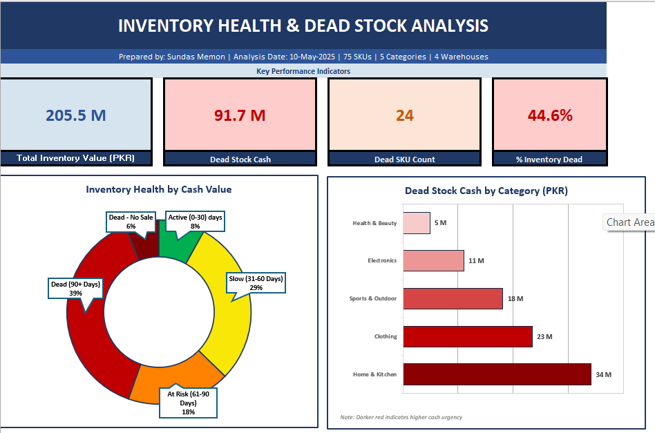
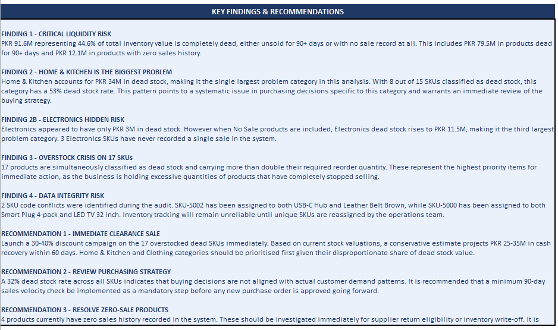

# Inventory-health-dead-stock-analysis
Excel-based inventory audit identifying PKR 91.7M in dead stock across 75 SKUs. Includes data cleaning log, aging analysis, pivot tables and executive dashboard.
# Inventory Health & Dead Stock Analysis

## Project Overview
A comprehensive inventory audit built in Microsoft Excel identifying PKR 91.7M in dead stock across a 75-SKU retail dataset. This project simulates a real-world inventory consulting engagement for a multi-warehouse retail business operating across 5 product categories and 4 warehouse locations in Pakistan.

---
## Business Problem
The business had PKR 205.5M invested in inventory but had no visibility into which products were bleeding cash silently. Without a structured analysis, dead stock accumulates undetected, locking working capital that could be reinvested in fast-moving products.
---
## Key Findings
- **PKR 91.7M (44.6%)** of total inventory is completely dead
- **24 SKUs** have not sold in 90+ days
- **4 SKUs** have zero sales history recorded
- **Home & Kitchen** is the biggest problem category — PKR 34M dead
- **Electronics** hidden risk — rises to PKR 11.5M when No Sale products included
- **17 products** are both dead AND overstocked beyond double reorder point
- **4 products** are actively being sold below cost price
- **2 SKU conflicts** identified — different products sharing same SKU code
- **3 products** have impossible negative inventory quantities
---
## Recommendations
1. Launch 30-40% clearance sale on 17 overstocked dead SKUs
2. Estimated cash recovery: PKR 25-35M within 60 days
3. Review Home & Kitchen purchasing strategy — 53% dead stock rate
4. Fix pricing on 4 loss-making products immediately
5. Resolve SKU conflicts before next inventory count
6. Implement 90-day sales velocity check before every purchase order
---
## Tools Used
- Microsoft Excel (Power Query, Pivot Tables, Advanced Formulas, Charts)
- Data Cleaning — 9 documented issues resolved
- Analysis — Stock aging, cash calculation, turnover ratio, reorder status
- Visualisation — Executive dashboard with KPI cards, donut chart, bar chart
---
## Excel Skills Demonstrated
| Skill | Usage |
|-------|-------|
| SUMIF / SUMIFS | Dead stock cash by category and aging bucket |
| COUNTIF | SKU counts per aging tier |
| IF / IFS / nested IF | Aging bucket classification, flag columns |
| DATE() function | Conservative placeholder for blank dates |
| TODAY() vs fixed date | Point-in-time audit approach |
| Power Query | Data type standardisation |
| Pivot Tables | Category and aging breakdown |
| Conditional Formatting | Alternating rows, heatmap |
| TRIM / PROPER | Text column standardisation |
| COUNTIF for duplicates | SKU conflict detection |
---
## Dataset
- **Source**: Synthetic dataset generated for realistic portfolio demonstration
- **Size**: 75 SKUs, 15 original columns, 19 columns after cleaning
- **Categories**: Clothing, Electronics, Health & Beauty, Home & Kitchen, Sports & Outdoor
- **Warehouses**: Karachi Central, Karachi North, Lahore Hub, Islamabad Storage
- **Analysis Date**: 10 May 2025 (fixed point-in-time audit)
---
## Project Structure
| Sheet | Purpose |
|-------|---------|
| RAW_DATA | Original uncleaned data — never modified |
| CLEANED | Fully cleaned dataset with 4 helper flag columns |
| ANALYSIS | 15-column analytical engine with all calculations |
| PT1_Category | Pivot — cash by category and aging bucket |
| PT2_AgingBucket | Pivot — SKU count and cash by aging tier |
| PT3_TopDeadStock | Pivot — top dead stock products sorted by cash value |
| DASHBOARD | Executive dashboard with KPIs, charts, analyst memo |
| CLEANING_LOG | 9 documented cleaning decisions with full audit trail |
---
## Data Cleaning Summary
9 issues identified and documented in CLEANING_LOG tab:
- 6 blank rows removed
- Data types corrected across all 15 columns
- 1 wrong date format corrected
- 4 blank dates filled with conservative placeholder
- 3 negative quantities flagged
- 4 margin errors flagged as critical business finding
- 2 SKU conflicts investigated and documented
- TRIM applied to all text columns
- PROPER case standardisation applied to Category column

---

## Dashboard Preview

---

## Analyst Memo

---

## About
**Prepared by**: Sundas Memon  
**Role**: Data Analyst  
**Tools**: Microsoft Excel  

